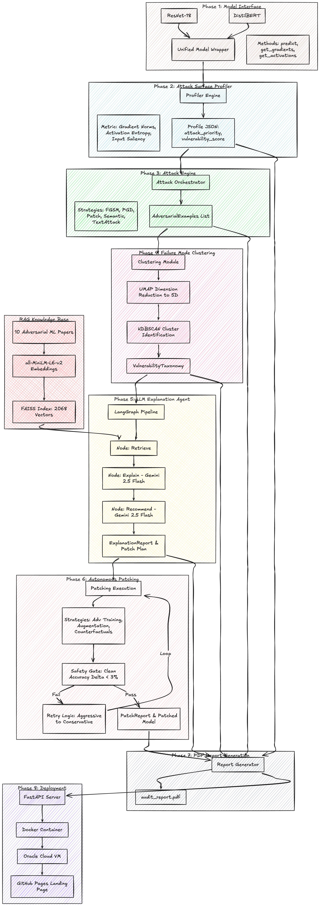

<p align="center">
  
</p>

<p align="center">
  
  
  
  
  
  
  
  
  
</p>

<h3 align="center">Autonomous ML Red-Teaming · Attack · Cluster · Explain · Patch · Report</h3>

<p align="center">
  <a href="https://ganglet.github.io/Anvil"><strong>Live Demo →</strong></a> &nbsp;|&nbsp;
  <a href="https://angshuman12-anvil.hf.space"><strong>API →</strong></a>
</p>

---

## What it does

ANVIL takes any PyTorch neural network, runs it through a fully autonomous 8-phase adversarial auditing pipeline, and produces a professional PDF audit report — with zero human decisions.

<p align="center">
  
</p>

---

## Pipeline Deep Dive

### Phase 1 — Model Interface

Any PyTorch network subclasses `BaseModel` and exposes three methods. ResNet-18 and DistilBERT ship as first-party wrappers.

```python
class ImageModel(BaseModel):
    def predict(self, x: Tensor) -> Tensor: ...          # → logits
    def get_gradients(self, x, y) -> Tensor: ...          # → ∂L/∂x
    def get_activations(self, x) -> Tensor: ...           # → penultimate layer
```

### Phase 2 — Attack Surface Profiler

| Signal | Method | Output |
|--------|--------|--------|
| Feature attribution | Captum Integrated Gradients | Per-pixel importance |
| Gradient magnitude | Saliency (|∂L/∂x|) | Sensitivity map |
| Vulnerability score | mean(gradient norm) × activation entropy | Scalar ∈ [0, 1] |
| Attack priority | Ranked by gradient norm per attack type | Ordered list |

### Phase 3 — Attack Engine

Four attack strategies, all implemented from scratch in PyTorch autograd:

| Attack | Type | Key hyperparameter |
|--------|------|--------------------|
| FGSM | Single-step gradient sign | ε = 0.03 |
| PGD | Iterative projected gradient | 40 steps, α = 0.01 |
| Adversarial Patch | Localised perturbation (Brown 2017) | patch_size = 32px |
| Semantic | Non-gradient: brightness, contrast, rotation, jitter | 4 transforms |

Each successful attack produces an `AdversarialExample` carrying the original tensor, perturbed tensor, true label, predicted label, attack name, epsilon, and per-sample confidence scores.

### Phase 4 — Failure Mode Clustering

Penultimate-layer activations encode *why* the model was fooled — not just *that* it was fooled. UMAP projects these high-dimensional vectors to a low-dimensional embedding preserving local manifold structure. HDBSCAN then finds density-based clusters without a fixed cluster count.

```
n_neighbors = min(15, N - 1)
n_components = min(5, N - 1)

If UMAP raises scipy.linalg.eigh (N < 20) → fallback to PCA(n_components=2)
Noise points (cluster = -1) are counted but not explained
```

### Phase 5 — LLM Explanation Agent

A stateful LangGraph agent with FAISS retrieval over 10 adversarial ML papers:

> Goodfellow et al. 2015 · Madry et al. 2018 · Carlini & Wagner 2017 · Brown et al. 2017 · Szegedy et al. 2014 · Papernot et al. 2016 · Xie et al. 2019 · Cohen et al. 2019 · Zhang et al. 2019 · Croce & Hein 2020

For each cluster the agent injects cluster statistics (centroid, attack distribution, member count) + retrieved paper chunks into a structured prompt. Gemini 2.5 Flash generates a grounded explanation with recommended patch strategy. The state graph can revisit reasoning if a coherence check fails.

### Phase 6 — Autonomous Patching

**Safety gate formula:**

$$score = 0.6 \times resistance\_gain + 0.4 \times accuracy\_retention$$

A patch is accepted only if **score ≥ 0.70** AND **accuracy drop ≤ 3%**. On failure the engine escalates to the next strategy (up to 3 attempts per cluster).

| Strategy | Mechanism |
|----------|-----------|
| Adversarial training | Fine-tune on attack set with corrected labels |
| Stylized augmentation | Domain-randomization via style transfer |
| Counterfactual generation | Synthesize near-boundary examples |
| Targeted augmentation | Cluster-specific oversampling |

### Phase 7 — Audit Report

ReportLab generates a multi-page PDF: cover page with audit metadata, executive summary, matplotlib radar chart of per-attack success rates (flat polygon = uniform robustness, spiked polygon = asymmetric weakness), per-cluster cards with LLM explanations and patch outcomes, methodology appendix.

### Phase 8 — REST API

```
POST /audit/upload    multipart: files[] + model + budget  →  { job_id }
GET  /audit/job/{id}  →  { status, vulnerability_score, clusters_found, report_filename }
GET  /report/{filename}  →  PDF stream
GET  /health           →  { status: "ok" }
```

Async job management via FastAPI `BackgroundTasks`. In-memory job store with polling. CORS configured for `ganglet.github.io`. Deployed via Docker on HuggingFace Spaces (free tier, 16 GB RAM).

---

## Stack

| Component | Technology | Why |
|-----------|-----------|-----|
| Core ML | PyTorch 2.x | Autograd for attacks, hooks for activations |
| Interpretability | Captum | IntegratedGradients + Saliency on any nn.Module |
| Dimensionality reduction | UMAP | Non-linear manifold vs. PCA's linear projection |
| Clustering | HDBSCAN | No fixed k; handles noise and arbitrary cluster shapes |
| Agent orchestration | LangGraph | Stateful graph, can revisit nodes on coherence failure |
| LLM | Gemini 2.5 Flash | Low latency, long context for paper RAG |
| Vector search | FAISS + nomic-embed-text | Fast dense retrieval over 10 adversarial ML papers |
| Report generation | ReportLab + matplotlib | Programmatic PDF, no template editing |
| API | FastAPI + uvicorn | Async, BackgroundTasks, multipart upload |
| Deployment | Docker + HuggingFace Spaces | Free public endpoint, 16 GB RAM |

---

## Quick Start

**Pip (recommended)**

```bash
pip install anvil-redteam
anvil --model resnet18 --budget 50   # CLI
anvil-serve                          # API server on :8000
```

**From source**

```bash
git clone https://github.com/Ganglet/Anvil
cd Anvil/Anvil_Project
pip install -e .

# Run the API server
uvicorn api:app --host 0.0.0.0 --port 8000

# Or run the CLI pipeline directly
python audit.py --model resnet18 --budget 50
```

**Docker**

```bash
docker pull ghcr.io/ganglet/anvil:latest
docker run -p 8000:8000 ghcr.io/ganglet/anvil:latest
```

Use the hosted demo at **[ganglet.github.io/Anvil](https://ganglet.github.io/Anvil)** — upload images, get a full PDF audit report back.

---

## Project Structure

```
Anvil_Project/
├── models/           # Phase 1 — BaseModel ABC + ResNet-18/DistilBERT wrappers
├── profiler/         # Phase 2 — AttackSurfaceProfiler (Captum)
├── attacks/          # Phase 3 — FGSM, PGD, Patch, Semantic + AttackEngine
├── clustering/       # Phase 4 — FeatureExtractor, FailureModeClusterer, VulnerabilityTaxonomy
├── agent/            # Phase 5 — LangGraph agent, FAISS RAG, Gemini integration
├── patching/         # Phase 6 — Patcher, 4 strategies, safety gate
├── reporter/         # Phase 7 — ReportLab PDF generation
├── api.py            # Phase 8 — FastAPI server with async job management
├── audit.py          # CLI entry point
├── requirements.txt
├── Dockerfile
└── frontend/         # React + Vite source for ganglet.github.io/Anvil
```

---

## Acknowledgments

- **PyTorch** — [pytorch.org](https://pytorch.org)
- **Captum** — [pytorch.org/captum](https://pytorch.org/captum)
- **UMAP-learn** — [github.com/lmcinnes/umap](https://github.com/lmcinnes/umap)
- **HDBSCAN** — [github.com/scikit-learn-contrib/hdbscan](https://github.com/scikit-learn-contrib/hdbscan)
- **LangGraph** — [langchain.com/langgraph](https://langchain.com/langgraph)
- **LangChain** — [langchain.com](https://langchain.com)
- **FAISS** — [github.com/facebookresearch/faiss](https://github.com/facebookresearch/faiss)
- **ReportLab** — [reportlab.com](https://reportlab.com)
- **Matplotlib** — [matplotlib.org](https://matplotlib.org)
- **FastAPI** — [fastapi.tiangolo.com](https://fastapi.tiangolo.com)
- **HuggingFace** — [huggingface.co](https://huggingface.co)
- **Adversarial ML Benchmark (ATB)** — [github.com/MadryLab/ATB](https://github.com/MadryLab/ATB)

---

## License

Code: MIT — see [LICENSE](LICENSE)

---

<p align="center">
  
</p>